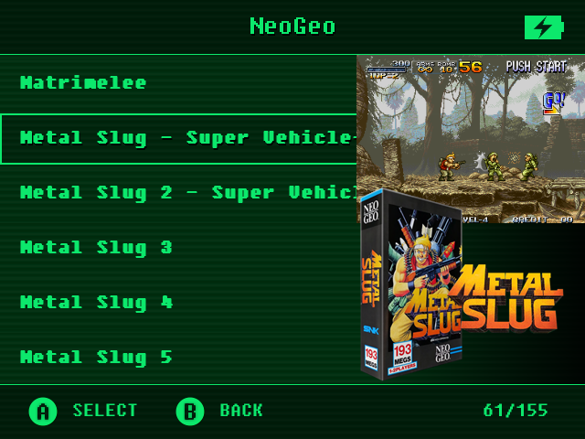
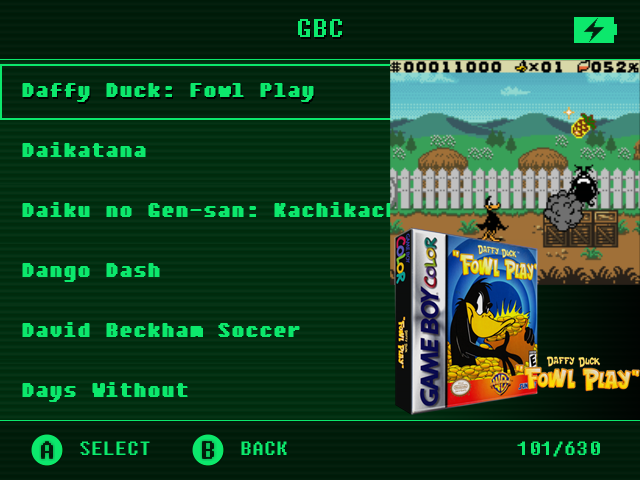

# onion-os-skraper-template
To set-up Skraper with custom template check out [this link](https://onionui.github.io/docs/advanced/scraping).

# 3 Image Mix (Screenshot + 3DBox + Whell) (Big Wheel)
It looks better on systems that primarily have portrait orientation boxes (height greater than width), such as Genesis, SNES, NES, NeoGeo, MAME, etc.

   
 

## Live Example:
  
  

# 3 Image Mix (Screenshot + 3DBox + Whell) (Small Wheel)
It looks better on systems that primarily have square boxes, such as Game Boy, Game Boy Advance, Playstation, NDS.

   
 

## Live Example:
 
 